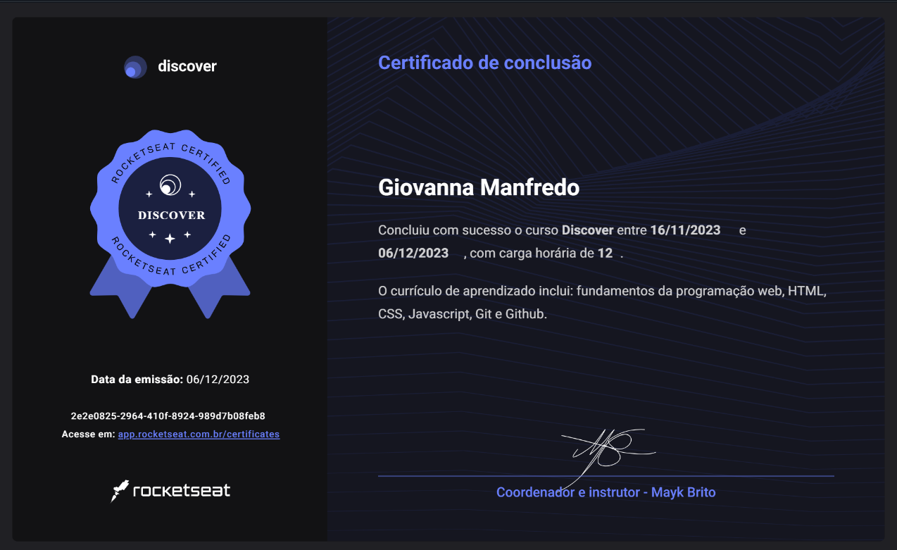

## 💻 Projeto

The postcard project is an adaptation of rocketseat's [Discover](https://app.rocketseat.com.br/discover) course project.

  

 

## 🧪 Tecnologias

This project was developed with the following technologies:

- [HTML]
- [CSS]
- [JavaScript]

 

## 📝 License

This project is under MIT license. See the [LICENSE](LICENSE.md) file for more details.

---
 

## Certificate

<!--START_SECTION:footer-->
